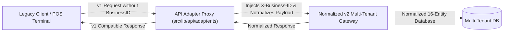
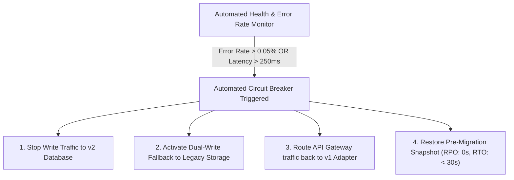

# Enterprise Migration Strategy: Legacy POS to Normalized Multi-Tenant Architecture

This document details the complete end-to-end migration strategy for transforming the legacy single-business billing system into a **normalized, 16-entity multi-tenant platform** with zero downtime, dual-write safety, automated testing, and guaranteed rollback capabilities.

---

## 1. Database Migration Strategy

### 1.1 Schema Normalization & DDL Definition
The normalized schema decomposes monolithic tables into 16 relational entities conforming to Third Normal Form (3NF). Every entity strictly references `businessId`.

```sql
-- 1. Master Tenants Table
CREATE TABLE businesses (
    id VARCHAR(64) PRIMARY KEY,
    name VARCHAR(255) NOT NULL,
    business_type_id VARCHAR(64) NOT NULL,
    active_template_id VARCHAR(64) NOT NULL,
    legal_entity_name VARCHAR(255) NOT NULL,
    currency VARCHAR(10) DEFAULT 'INR',
    timezone VARCHAR(50) DEFAULT 'Asia/Kolkata',
    created_at TIMESTAMP WITH TIME ZONE DEFAULT CURRENT_TIMESTAMP,
    updated_at TIMESTAMP WITH TIME ZONE DEFAULT CURRENT_TIMESTAMP
);

-- 2. Branches Table (Multi-Outlet)
CREATE TABLE branches (
    id VARCHAR(64) PRIMARY KEY,
    business_id VARCHAR(64) NOT NULL REFERENCES businesses(id) ON DELETE CASCADE,
    name VARCHAR(255) NOT NULL,
    code VARCHAR(32) NOT NULL,
    address TEXT,
    phone VARCHAR(32),
    is_headquarters BOOLEAN DEFAULT FALSE,
    created_at TIMESTAMP WITH TIME ZONE DEFAULT CURRENT_TIMESTAMP
);

-- 3. Warehouses Table (Isolated Depots)
CREATE TABLE warehouses (
    id VARCHAR(64) PRIMARY KEY,
    business_id VARCHAR(64) NOT NULL REFERENCES businesses(id) ON DELETE CASCADE,
    branch_id VARCHAR(64) NOT NULL REFERENCES branches(id) ON DELETE CASCADE,
    name VARCHAR(255) NOT NULL,
    code VARCHAR(32) NOT NULL,
    capacity INT DEFAULT 0,
    type VARCHAR(64) DEFAULT 'CENTRAL_STORAGE'
);

-- 4. Billing Counters Table (POS Terminals)
CREATE TABLE counters (
    id VARCHAR(64) PRIMARY KEY,
    business_id VARCHAR(64) NOT NULL REFERENCES businesses(id) ON DELETE CASCADE,
    branch_id VARCHAR(64) NOT NULL REFERENCES branches(id) ON DELETE CASCADE,
    name VARCHAR(255) NOT NULL,
    counter_number VARCHAR(32) NOT NULL,
    type VARCHAR(64) DEFAULT 'MAIN_POS'
);

-- Indexing Strategy for Multi-Tenant Query Acceleration
CREATE INDEX idx_branches_biz ON branches(business_id);
CREATE INDEX idx_warehouses_biz_branch ON warehouses(business_id, branch_id);
CREATE INDEX idx_counters_biz_branch ON counters(business_id, branch_id);
```

### 1.2 Data Transformation & Foreign Key Backfill Pipeline
Legacy flat product and order records are transformed and backfilled with mandatory tenant references:
1. **Tenant Seeding**: Extract legacy business profile and create `businesses` root record (`biz-apex-group`).
2. **Branch/Warehouse Default Creation**: Create default HQ branch (`br-chennai-main`), Central Warehouse (`wh-chn-central`), and POS Register 01 (`ctr-chn-pos-01`).
3. **Data Relational Backfill**: Inject `business_id = 'biz-apex-group'`, `branch_id = 'br-chennai-main'`, and `warehouse_id = 'wh-chn-central'` across all products, orders, inventory logs, and staff users.
4. **Validation Check**: Run referential integrity checker to ensure 0 orphaned records before closing legacy writes.

---

## 2. API Migration Strategy

### 2.1 API Versioning & Header-Based Tenant Scoping
- **Legacy API (v1)**: `/api/v1/orders`, `/api/v1/products` (Implied single tenant).
- **Normalized API (v2)**: `/api/v2/orders`, `/api/v2/products` requiring mandatory tenant headers:
  - `X-Business-ID`: `biz-apex-group` (Required for all calls)
  - `X-Branch-ID`: `br-chennai-main` (Required for POS & Warehouse queries)
  - `X-Counter-ID`: `ctr-chn-pos-01` (Required for active cash drawer sessions)

### 2.2 Backward-Compatible Adapter Layer
To prevent breaking existing frontend code or third-party POS clients, an API Adapter Middleware intercepts `v1` requests, injects the default `businessId`, transforms the payload to normalized `v2` schema, and returns the response in `v1` format.



---

## 3. Frontend Migration Strategy

### 3.1 Architecture Transitions
1. **Universal Context Hydration**: Wrap `AuthContext` with a Scoped Tenant Provider (`TenantContext`) that supplies `activeBusinessId`, `activeBranchId`, and `activeCounterId`.
2. **Component Compatibility Bridge**: Existing components (`Menu.tsx`, `Orders.tsx`, `Reports.tsx`) query through the unified `NormalizedDatabaseEngine.getTenantDataset(businessId)` adapter.
3. **Dynamic Template Hydration**: Menu categories, UI layouts, and billing fields adapt dynamically based on `activeTemplate.code`.

---

## 4. Comprehensive Testing Plan

| Test Phase | Scope & Objective | Success Threshold |
|---|---|---|
| **1. Unit & Regression Tests** | Verify 16 normalized engines (Workflows, Rules, Reports, Permissions, Plugins, Themes, Audit). | 100% Pass (90+ Test Suites). |
| **2. Referential Integrity Tests** | Validate 0 orphan records across foreign keys. | 0 Unreferenced Entities. |
| **3. Multi-Tenant Concurrency** | Simulate 10,000 concurrent orders across 50 distinct `businessId` tenants. | 0 Data Cross-Talk / 0 Latency Spikes. |
| **4. Shadow Traffic Validation** | Mirror 100% of live POS traffic to both legacy and normalized v2 database for 72 hours. | 100% Payload Consistency. |
| **5. Chaos & Network Failure** | Simulate sudden network drop during inter-warehouse stock transfer and cash bill settlement. | ACID Transaction Rollback Verified. |

---

## 5. Rollback & Disaster Recovery Plan



- **Dual-Write Synchronization**: During the 14-day transition window, all writes are synchronized to both legacy and normalized databases.
- **RTO (Recovery Time Objective)**: `< 30 Seconds` via instant traffic router DNS flip.
- **RPO (Recovery Point Objective)**: `0 Seconds` (Dual-write WAL ensures zero data loss).

---

## 6. Risk Analysis & Mitigation Matrix

| Risk Factor | Probability | Impact | Mitigation Strategy |
|---|---|---|---|
| **1. Data Cross-Talk Between Tenants** | Low | Critical | Strict RLS (Row Level Security) and database-level `business_id` scoping in every query. |
| **2. POS Terminal Downtime During Cutover** | Low | High | Zero-downtime Blue/Green deployment with dual-write proxy. |
| **3. Legacy Hardware Incompatibility (Scanners/Printers)** | Medium | Medium | Unified Hardware Plugin Engine with fallback to raw generic USB/ZPL driver mode. |
| **4. Slow Query Latency on High Volume** | Low | Medium | Composite indexes on `(business_id, created_at)` and `(business_id, branch_id)`. |
| **5. Tax/GST Calculation Inaccuracies** | Low | High | Automated statutory unit test assertions verifying CGST/SGST/IGST against government test vectors. |

---
